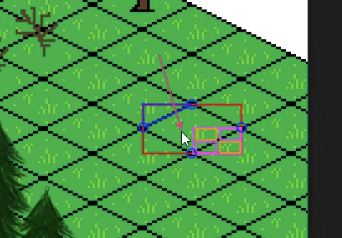

# Anotações das reuniões  

## 2022/08/06  

Conversamos sobre orientação de TCC. Chegamos a um assunto para o Termo de TCC1.

## 2022/08/22

### [Termo](./Termo.pdf "Termo")  

## 2022-09-05 - 11:41

[2022-09-05_reuniao.pdf](2022-09-05_reuniao.pdf "2022-09-05_reuniao.pdf")  

## 2022-09-11

Pré-Projeto: dúvidas sobre correlatos e justificativa.  
[2022-09-11_reuniao](2022-09-11_reuniao.pdf "2022-09-11_reuniao")  

## 2022-10-01 - 15:18

Revisão final do pré-projeto (liberei para entrega): [2022-09-30_PreProjeto_Dalton](2022-09-30_PreProjeto_Dalton.pdf "2022-09-30_PreProjeto_Dalton")  

## 2022-10-06 - 21:01

Entrega do Pré-Projeto.

[2022-10-06_PreProjeto_Entregue.docx](2022-10-06_PreProjeto_Entregue.docx "2022-10-06_PreProjeto_Entregue.docx")  
[2022-10-06_PreProjeto_Entregue.pdf](2022-10-06_PreProjeto_Entregue.pdf "2022-10-06_PreProjeto_Entregue.pdf")  

## 2022-11-17 - 11:00

[2022-11-17_PreProjeto_Defesa_slides.pdf](2022-11-17_PreProjeto_Defesa_slides.pdf "2022-11-17_PreProjeto_Defesa_slides.pdf")  
[2022-11-17_PreProjeto_Defesa.mp4](2022-11-17_PreProjeto_Defesa.mp4 "2022-11-17_PreProjeto_Defesa.mp4")  

## 2023-02-28 - 17:35

[TccAlex]: https://www.furb.br/dsc/arquivos/tccs/monografias/2020_2_alex-serodio-goncalves_monografia.pdf "TccAlex"  

### Teórica

Deixa um pouco parado. Ver o que o prof. Maurício vai passando na aula de TCC2.  
Usar como modelo para o artigo o TCC [TccAlex].  
  
### Prática

ATENÇÃO: não é um jogo, e sim um ambiente de testes dos 3 em um jogo.  

Linguagem: Python  
Game: [PyGame](https://www.pygame.org/ "PyGame")  

- jogo isométrico  
  - vai estudando de acordo com a demanda  

- ray casting \[14-03-2023\]  
  - está testando um algoritmo, mas precisa ser otimizado (não considera o plano "far")  
  - [https://ncase.me/sight-and-light/](https://ncase.me/sight-and-light/)  
    - fontes: pode usar  

- Wave Function Collapse (WFC)  

### Analisar

Usar o [TccAlex]  

## 2023-03-14 - 17:31

Conseguiu entender os 3 tipos de algoritmos de Ray Tracing.  
Semana que vem não precisamos conversar.  
Vai implementar os 3 tipos de algoritmos. Já com representação de Debug Visual.  
Tem um problema de seleção no Sprits no plano Isométrico (cantos).  
Vai tentar usar a abordagem de seleção por triângulo retângulo.  
Pensei em rotina recursiva de BBox internas.  
  
Vai tentar implementar esta rotina.  

Depois tem ainda o algoritmo WFC.  

## 2023-04-04 - 17:36

### Ray Casting

- aumentando o padrão  
- linhas horizontal e vertical  
- Várias linhas  

Não precisamos ter reunião na próxima semana.  
Vai fazer: Wave Function Collapse (WFC)  

## 2023-04-18 - 17:57

Fez o WFC. Tem um erro a cada 20 execução. Erro de estouro da direita.  
Vai fazer:

- arrumar erro 20 execução.  
- trazer métodos de desenho para o RayCasting.  
- talvez usar modelos 3D para pegar as imagens nos planos isométricos e assim não precisar ficar redesenhando.  
- .. depois .. avaliar tempos dos algoritmos.  

Não precisamos ter reunião na próxima semana.  

## 2023-05-02 - 17:43

- [x] usar o métodos de  desenho do PayGame pois está com problemas no controle do teclado e mouse.  
- [x] fazer restrições no WFC para controlar parâmetros externos (qtd. água).  
  - em vez de um vetor usar arquivo JSon. 

## 2023-05-10 - 18:08

Feito

Basicamente o mapa que antes era uma array de arrays (2D), agora virou um dicionário com chave => valor, sendo a chave a posição xy do chunk (por exemplo 1,1), e o valor, uma lista dos sprites dentro do chunk.
Com base na distância de renderização, é realizado um cálculo pra ver quais são todos os chunks que irão ser desenhados na tela (no vídeo a distância é igual a 2, então pega 2 chunks em cada direção ficando um 5x5).
Aí ele percorre essa lista de 25 chunks e desenha somente os tiles que estão dentro deles, ignorando o restante do mundo gerado.

A fazer

Tratar os gargalos de performance do novo estilo de plotagem do mundo.
Adicionar um fog para esconder os chunks não plotados.
Por enquanto, o mundo ainda é gerado somente no começo da execução do programa. Vou fazer para gerá-lo conforme o jogador vai andando para alguma das bordas do mapa. Por exemplo: quando o usuário se aproxima uma quantidade X de chunks da borda do mapa, eu chamo o algoritmo do WFC para gerar novos chunks e colocá-los no dicionário mencionado anteriormente, assim, basicamente é possível andar infinitamente para qualquer um dos lados.
